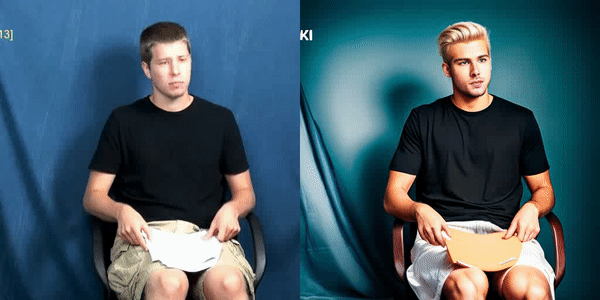

# DiffSLVA: Harnessing Diffusion Models for Sign Language Video Anonymization

## This repository contains demos for DiffSLVA：Harnessing Diffusion Models for Sign Language Video Anonymization
We propose text-guided zero-shot sign language video anonymization.
## Anonymization result examples:

(1) Input prompt for anonymization: a superman in blue uniform is making gestures

(2) Input prompt for anonymization: a handsome man in CG style, blonde hair, is making gestures

(3) Input prompt for anonymization: a handsome man in CG style, blonde hair, is making gestures

The original signer is on the left is producing the ASL sentences with 
glosses, hand shapes, non-manual grammatical markings, and translations 
as shown below, available at https://dai.cs.rutgers.edu/dai/s/dai :

(1) and (2) - taken from the ASLLRP file Cory_2013-6-27_sc115, Utterance 22

(3) - taken from the ASLLRP file Cory_2013-6-27_sc113, Utterance 28

